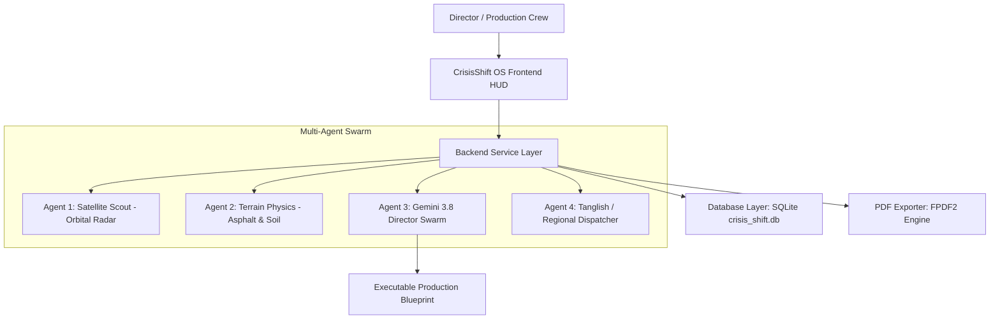

# 🎬 CrisisShift OS | Devpost Submission Writeup
**Category / Track:** Gemini Enterprise Agent Platform / Director Track  
**Hackathon:** Agentic Cinema: The Blockbuster Hackathon  

---

## 📌 Project Overview
* **Project Name:** CrisisShift OS — Autonomous Cinema Command
* **Short Tagline:** Transforming real-world film set chaos into deterministic autonomous cinema orchestration with Gemini 3.8 and Satellite Radar Physics.
* **Target Audience:** Film Directors, First Assistant Directors (1st ADs), Stunt Coordinators, Camera Rigs / Technocrane Engineers, and Production Safety Crews.

---

## 💡 Inspiration
In major film productions worldwide—especially Indian and Hollywood blockbuster shoots—a single day of outdoor shoot cancellation due to sudden unpredicted weather or road slickness costs between **$50,000 to over $500,000 (₹40 Lakhs to ₹4 Crores)** in equipment rental fees, lead actor dates, and crew downtime. 

Worse, when heavy vehicle stunts or massive 50-foot Technocranes operate on damp asphalt or saturated mud, hydroplaning accidents and outrigger tip-overs cause catastrophic injuries.

Existing production tools are static Excel call sheets and generic weather phone apps that don't calculate **real physics** or coordinate **autonomous agent crews**. We built **CrisisShift OS** to give film directors an autonomous multi-agent command system powered by **Gemini 3.8**, grounding directorial decisions in real-time satellite atmospheric radar, surface asphalt friction equations ($\mu$), and instant bilingual **Tanglish/English** set dispatches.

---

## 🚀 What It Does
1. **Real-Time Data & Sensor Integration:**
   - Connects live to OpenStreetMap Nominatim and Open-Meteo atmospheric radar to extract live precipitation, humidity, wind vectors, and temperatures for any shooting location on Earth.
   - Generates authentic ArcGIS high-resolution satellite optical reconnaissance and interactive Pydeck 3D GPS radar with a bright red live location beacon.

2. **Terrain Physics & Rig Safety Engine:**
   - Computes dynamic asphalt friction coefficients ($\mu = 0.32$ wet hydroplane hazard to $\mu = 0.85$ optimal dry asphalt).
   - Evaluates soil density and bearing pressure capacity ($\sigma_{max} = 150 \text{ kPa}$) to ensure heavy Technocranes don't sink or overturn.

3. **Gemini 3.8 Multi-Agent Directorial Swarm:**
   - **Agent 1 (Satellite Scout):** Scans orbital radar sensors and atmospheric threat vectors.
   - **Agent 2 (Terrain Physics Engine):** Computes ground friction, braking distance multipliers, and crane base load.
   - **Agent 3 (Director Swarm):** Synthesizes live telemetry and makes deterministic calls: **🟢 FULL GREEN LIGHT** vs **🔴 WEATHER HALT** with indoor soundstage redirection.
   - **Agent 4 (Crew Dispatcher):** Formats emergency call sheets and WhatsApp broadcasts.

4. **Tanglish & Regional Indian Cinema Localization:**
   - On shooting sets in South India and Bollywood, instructions are given in mixed regional dialects like **Tanglish** (Tamil + English). CrisisShift OS natively generates production dispatches in Tanglish, Tamil, Hindi, Telugu, and English so crew leads immediately grasp safety directives without translation friction.

5. **Mission Audit Database & PDF Export:**
   - Automatically archives every recon run in an SQLite database.
   - Generates 1-click printable **PDF Production Dispatches** and Markdown reports for studio executives and insurance logs.

---

## 🏗️ Architecture & Tech Stack

### Architecture: 3-Tier Enterprise Design
* **Frontend UI Layer (`frontend/`):** Streamlit 1.54, Next-Gen Cyberpunk / Dark Obsidian & Electric Amber HUD Design System, Pydeck 3D interactive mapping, Orbitron & Space Grotesk typography.
* **Backend Services Layer (`backend/`):** Google GenAI SDK (`gemini-3.8-flash`), Open-Meteo REST API, OpenStreetMap Nominatim Geocoding, ArcGIS World Imagery Server, Physics Engine (`telemetry_service.py`), FPDF2 Unicode PDF Exporter (`pdf_exporter.py`).
* **Database Layer (`database/`):** SQLite (`crisis_shift.db`) with schema for mission audit logs, scene breakdowns, and crew emergency rosters.

---

## 🧗 Challenges We Ran Into
1. **FPDF Unicode Emoji Exceptions:**
   - Generating PDF dispatches failed initially with `FPDFUnicodeEncodingException` because core Latin Helvetica fonts do not support 4-byte unicode emojis (like 🛰️, ⛈️, 🔴). We engineered a dedicated `sanitize_pdf_text()` pipeline that translates unicode emojis into clean, high-contrast text badges (`[SATELLITE]`, `[HALT]`, `[GREEN LIGHT]`) without crashing.
2. **Deterministic Physics Arbitration in Multi-Agent Swarm:**
   - Ensuring that Gemini 3.8 never hallucinates a "Green Light" during torrential rain required grounding the prompt in verified mathematical thresholds ($\text{Rain} > 1.0\text{mm} \implies \mu < 0.40 \implies \text{HALT}$).
3. **Browser Autofill Suppression:**
   - Modern Chromium browsers aggressively displayed "Saved Info" dropdowns over coordinates inputs. We injected custom DOM attribute overrides (`autocomplete="off"`, `data-lpignore="true"`) to provide an uninterrupted manual typing experience.

---

## 🏆 Accomplishments That We're Proud Of
* **Sub-15 Second Autonomous Latency:** Instant atmospheric recon, friction calculation, and directorial blueprint generation in under 15 seconds.
* **True Multi-Agent Determinism:** Ground truth satellite data directly controls the agent swarm verdict—eliminating expensive production guesswork.
* **Set-Ready Tanglish Localization:** Breaking language barriers on regional film sets by generating native Tanglish dispatches that First ADs can send directly to crew WhatsApp groups.
* **Exportable Audit Trail:** Full SQLite database logging and instant PDF/MD dispatch downloads for production insurance compliance.

---

## 🔮 What's Next for CrisisShift OS
* **Managed MCP Server Adapter:** Connecting CrisisShift OS via Model Context Protocol (MCP) directly to studio production accounting software (e.g. Movie Magic Scheduling) and real-time drone telemetry feeds.
* **Live Cast/Crew WhatsApp SMS Bot:** Direct Twilio/WhatsApp Business API integration to dispatch emergency alerts to 200+ crew members simultaneously.
