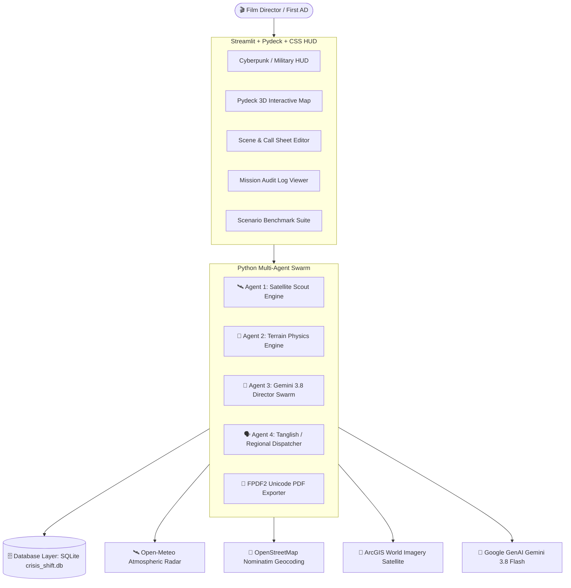

# 🎬 CrisisShift OS — Autonomous Cinema Command

[](https://cloud.google.com/vertex-ai)
[](https://python.org)
[](https://streamlit.io)
[](https://sqlite.org)
[](https://agentic-cinema.devpost.com/)

> **Ground-Truth Production Orchestration // Atmospheric Radar + Surface Asphalt Physics + Multilingual Agent Swarm**

Built for the **[Agentic Cinema: The Blockbuster Hackathon](https://agentic-cinema.devpost.com/)** on Devpost.

---gfff

## 🏛️ Architecture Overview

CrisisShift OS is engineered as an enterprise-grade **3-Tier Architecture**:



---

## 🌟 Key Features

1. **🛰️ Real-Time Atmospheric Radar & Satellite Recon:**
   - Real-time live queries to Open-Meteo & OpenStreetMap Nominatim for any location worldwide.
   - High-resolution ArcGIS optical satellite view + Pydeck interactive 3D map with bright red tactical beacon.

2. **🔬 Surface Asphalt Friction & Rig Physics Engine:**
   - Calculates dynamic road friction ($\mu = 0.32$ wet hydroplane hazard to $\mu = 0.85$ optimal dry surface).
   - Evaluates Technocrane soil bearing load capacity ($\sigma_{max} = 150 \text{ kPa}$) to prevent crane tip-overs.

3. **🧠 Gemini 3.8 Multi-Agent Directorial Swarm:**
   - Autonomous multi-agent coordination between Scout, Physics, Director, and Dispatcher agents.
   - Deterministic verdicts: **🟢 FULL GREEN LIGHT** (proceed with stunts) vs **🔴 WEATHER HALT** (protect $500k gear, redirect to covered soundstage).

4. **🌐 Tanglish & Regional Cinema Localization:**
   - Native bilingual dispatch support for **Tanglish** (Tamil in English script), Tamil, Hindi, Telugu, Malayalam, Kannada, and English.
   - Enables First ADs to dispatch instant alerts directly to Indian film crew WhatsApp groups without language friction.

5. **📄 Fail-Safe Printable PDF & Markdown Exports:**
   - 1-click printable PDF production blueprint generation with Unicode emoji compatibility for studio insurance documentation.

6. **🧪 Stress-Test Benchmark Suite:**
   - 5 pre-configured cinema crisis scenarios (Coimbatore Cloudburst, Chennai Beach Sea Fog, Ooty Mountain Gale, Studio Soundstage Baseline, Madurai Heatwave).

---

## 📁 Repository Structure

```
crisis-shift-ai/
├── app.py                      # Main Streamlit HUD Application
├── requirements.txt            # Python Dependencies
├── pyrightconfig.json          # Language Server & Linter Configuration
├── DEVPOST_SUBMISSION.md       # Devpost Submission Form Content
├── README.md                   # Project Documentation
├── crisis_shift.db             # SQLite Production Database
│
├── .vscode/
│   └── settings.json           # IDE & Python Interpreter Settings
│
├── database/                   # 🗄️ DATABASE LAYER
│   ├── __init__.py
│   ├── models.py               # TelemetryData, PhysicsAssessment, ReconMissionLog
│   └── db.py                   # SQLite Connection & CRUD Operations
│
├── backend/                    # ⚙️ BACKEND SERVICES & AI SWARM
│   ├── __init__.py
│   ├── telemetry_service.py    # Live Weather & Asphalt Friction Physics Engine
│   ├── satellite_service.py    # ArcGIS Satellite Optics URL Generator
│   ├── agent_swarm.py          # Gemini 3.8 Flash Multi-Agent Swarm
│   └── pdf_exporter.py         # Unicode-Safe FPDF2 Printable PDF Exporter
│
└── frontend/                   # 🎨 FRONTEND UI COMPONENTS
    ├── __init__.py
    ├── styles.py               # Cyberpunk / Dark Obsidian HUD Design System
    ├── sidebar.py              # Sidebar Mission Parameter Controls
    ├── hud_components.py       # Live HUD, Multi-Agent Card & Pydeck Map
    ├── scene_manager.py        # Film Scene Database Schedule Manager
    ├── history_tab.py          # Mission Audit Log Explorer
    └── test_cases_tab.py       # 5-Scenario Cinema Stress-Test Suite
```

---

## 🚀 Quick Start Guide

### 1. Clone & Navigate
```bash
git clone https://github.com/prabakar09/crisis-shift-ai.git
cd crisis-shift-ai
```

### 2. Install Dependencies
```bash
pip install -r requirements.txt
```

### 3. Launch Application
```bash
streamlit run app.py
```

### 4. How to Use
1. Enter your **Google Gemini API Key** in the left sidebar.
2. Type any shooting location in the world (e.g. `Coimbatore`, `Chennai`, `London`, `Tokyo`).
3. Enter your scheduled scene requirements.
4. Click **⚡ EXECUTE REAL-TIME SATELLITE RECON & RUN SWARM**.
5. Review the ground physics metrics, satellite imagery, and AI Director Blueprint.
6. Export the report as **📄 PDF (.PDF)** or **📥 Markdown (.MD)**!

---

## 📤 Pushing to GitHub (Step-by-Step)

To upload this project to your public GitHub repository:

```bash
# 1. Initialize git (if not already done)
git init

# 2. Add all files
git add .

# 3. Commit changes
git commit -m "feat: CrisisShift OS 3-tier architecture with Gemini 3.8 Swarm & Physics Engine"

# 4. Set main branch
git branch -M main

# 5. Link your GitHub remote repository
git remote add origin https://github.com/prabakar09/crisis-shift-ai.git

# 6. Push to GitHub
git push -u origin main
```
