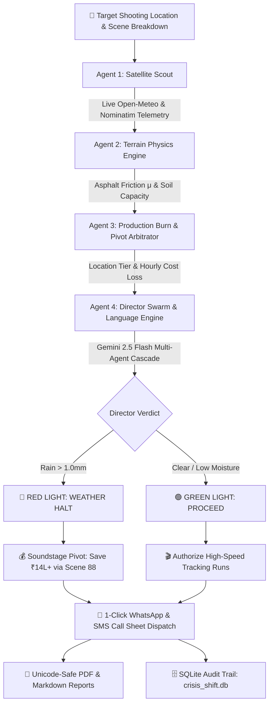

# 🎬 CrisisShift OS (v2.0) | Autonomous Cinema Command & Contingency Swarm

<p align="center">
  
  
  
  
  
  <a href="LICENSE"></a>
</p>

> **Author & Lead Architect:** **Prabakar A** ([@prabakar09](https://github.com/prabakar09))  
> **Department:** Artificial Intelligence & Data Science (AI & DS)  
> **Campus:** KGiSL Institute of Technology (KiTE), Autonomous, Coimbatore  
> **Ecosystem:** Google Student Community @ KiTE  

> [!IMPORTANT]
> **🚀 STRICT VIEW-ONLY & PROPRIETARY STARTUP IP NOTICE**  
> CrisisShift OS is proprietary startup technology architected by **Prabakar A**.  
> **1. ABSOLUTE NO-COPYING RULE:** Copying, cloning, scraping, or duplicating the code, prompt logic, or physics math into any other project is **STRICTLY FORBIDDEN**. Code is for academic inspection on GitHub only.  
> **2. COMMERCIAL DEPLOYMENT RESTRICTION:** Any commercial use, production pilot, studio adoption, or closed-source distribution requires an official signed license.  
> 📩 **Permission & Commercial Licensing Inquiries:** Contact **Prabakar A** at [`prabakar2699@gmail.com`](mailto:prabakar2699@gmail.com) with subject `[CRISISSHIFT OS] Permission Request`.

---

## 💡 The Real-World Cinema Problem
A high-budget film production is a capital-burning mobile operation. A standard Tier-1 exterior action shoot involves lead actors, 60–100 union technicians (FEFSI/FWICE guild), multi-crore Technocranes, anamorphic camera packages (Arri Alexa / Red V-Raptor), stunt drivers, police roadblock permits, and generator convoys.

**Every idle hour burns ₹2.5 to ₹10+ Lakhs.**

When sudden weather anomalies occur (e.g., sudden cloudbursts, heavy sea fog, unpredicted rains):
* Line Producers panic over burning budgets.
* Stunt Directors hesitate over hydroplaning hazard thresholds on slick asphalt.
* Directors and 1st ADs lose 2–4 hours debating next steps due to ego and lack of objective data.
* **The Result:** Massive financial loss (₹15L–₹50L per day), wrecked call sheets, and severe safety risks.

**CrisisShift OS** solves this by removing hesitation through **cold, automated ground truth**.

---

## 🤖 Multi-Agent System Architecture



### 🛰️ The 4 Autonomous Agents:
1. **Agent 1 (Satellite Scout):** Queries live orbital satellite and atmospheric sensors (Open-Meteo & OpenStreetMap Nominatim) for any coordinates worldwide (precipitation mm, wind vector, ambient temperature, relative humidity).
2. **Agent 2 (Terrain Physics Engine):** Computes ground-truth road asphalt friction ($\mu = 0.32 - 0.85$), hydroplaning crash danger, and Technocrane outrigger soil capacity ($150\text{ kPa}$).
3. **Agent 3 (Production Burn & Financial Pivot Arbitrator):** Classifies locations into 4 Cinema Tiers (International Hub, Metro Cinema Capital, Hill Station, Regional Center). Models cast wages, union crew fees, rig rentals, and municipal permit costs to quantify exact downtime losses and the financial buffer saved by an immediate soundstage swap.
4. **Agent 4 (Director Swarm & Regional Dispatcher):** Synthesizes the final directorial call sheet dispatch in **Tanglish**, **Tamil**, **Hindi**, or **English**, complete with 1-click WhatsApp alerts for department leads (Stunt Coordinator, DoP, 1st AD, Line Producer).

---

## 🌟 Key Features

* **🛰️ Authentic Satellite Optical Optics & Pydeck GPS Radar:** Renders live ArcGIS high-resolution Earth satellite surface tiles alongside an interactive 3D Pydeck radar map displaying a 500m Red Hazard Zone and 1200m Green Safe Staging Perimeter.
* **💰 Real-Time Production Financial Burn Engine:**
  * Computes location hourly burn rate (e.g., `₹2.82L/hr` for Coimbatore vs `₹4.26L/hr` for Chennai Metro).
  * Calculates financial delay exposure vs. budget saved by an autonomous indoor soundstage pivot.
* **📲 1-Click WhatsApp & SMS Crew Dispatch:** Instantly pre-formats tailored WhatsApp Web messages (`https://wa.me/...`) for key department heads:
  * **Stunt Coordinator:** Vehicle abort protocols and traction tests.
  * **DoP (Camera):** IP67 rain covers and anti-fog heating alerts.
  * **1st AD:** Emergency call sheet re-routing to soundstages.
  * **Production Head:** Financial mitigation tracking.
* **🌐 Native Tanglish & Multilingual Cinema Support:** Tailored specifically for Indian film sets (FEFSI guild culture, First Assistant Directors, and regional crew communication).
* **📄 Unicode-Safe PDF Exporter:** Compiles executive dispatches into downloadable, dark-mode cinema call sheet PDFs using `fpdf2` with automatic emoji Latin-1 sanitization.
* **🧪 Benchmark Test Suite:** 5 pre-configured cinema crisis scenarios (Coimbatore Highway Chase, Chennai Beach Explosion, Ooty Mountain Drift, Soundstage Baseline, Madurai Heatwave).

---

## 🚀 Quick Start

### 1. Install Dependencies
```bash
pip install -r requirements.txt
```

### 2. Configure API Key (Optional)
Get a free key from [Google AI Studio](https://aistudio.google.com/):
```bash
export GEMINI_API_KEY="your_api_key_here"  # Windows PowerShell: $env:GEMINI_API_KEY="your_api_key_here"
```
*(Note: CrisisShift OS features a deterministic high-fidelity offline fallback engine that runs even without an active API key).*

### 3. Run Web GUI (Streamlit)
```bash
streamlit run app.py
```

### 4. Run Headless CLI Tool
```bash
# Analyze Coimbatore highway cloudburst in Tanglish:
python cli.py --location "Coimbatore" --mode "rain" --lang "Tanglish"

# Analyze Marina Beach in live weather:
python cli.py --location "Marina Beach, Chennai" --mode "live" --lang "English"
```

### 5. Run Automated Tests
```bash
pytest projects/07_crisis_shift_ai/tests/ -v
```

---

## 🏛️ Author & Copyright Notice
Created and architected by **Prabakar A** ([@prabakar09](https://github.com/prabakar09)), Artificial Intelligence & Data Science (AI & DS), KGiSL Institute of Technology (KiTE). Part of the **KGISL-CAMPUS-SOLVERS** engineering initiative.

---

## 📜 Strict View-Only & Proprietary Startup License
Copyright (c) 2026 **Prabakar A**. All Rights Reserved.  
This software is governed by the **[CRISISSHIFT OS STRICT VIEW-ONLY & PROPRIETARY STARTUP LICENSE](LICENSE)**.

> **⚠️ STRICT VIEW-ONLY ENFORCEMENT (NO-COPYING ALLOWED):**  
> This source code is provided solely for academic review and code inspection on GitHub.  
> **COPYING IS FORBIDDEN:** You are strictly prohibited from copying, cloning, downloading for retention, extracting, or duplicating any code, physics equations, prompt architecture, or models into any other codebase or repository.  
> **Commercial Use / Studio Deployment:** If you are a film studio, producer, production company, or enterprise wishing to license, pilot, or use CrisisShift OS, you **MUST obtain prior written permission** by contacting the founder:  
> 📧 **Email:** [prabakar2699@gmail.com](mailto:prabakar2699@gmail.com)  
> 💬 **Subject:** `[CRISISSHIFT OS] Formal Permission & Commercial Licensing Request`
